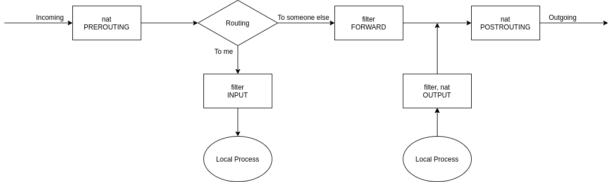
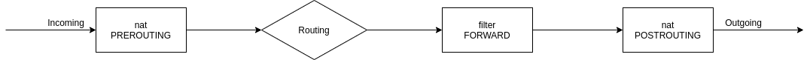

Iptables is an utility in Linux which controls IP packets processing. It works on the third layer -- Internet layer, and operates on IP packets. [This video](https://youtu.be/w_vGD-96O54) introduces the basics of iptables, and this is a quick note. 

## Iptables diagram

Iptables provide 5 tables (filter, nat, mangle, security, raw), but the most commonly used are the _filter_ table and the _nat_ table. Tables are organized as _chains_, and there are totally 5 predefined chains, PREROUTING, POSTROUTING, INPUT, FORWARD and OUTPUT.

Here we focus on the _filter_ table and _nat_ table.

| Table  |           Functionality           |             Chains              |
| :----: | :-------------------------------: | :-----------------------------: |
| filter |         packet filtering          |     INPUT, FORWARD, OUTPUT      |
|  nat   | Network Address Translation (NAT) | PREROUTING, POSTROUTING, OUTPUT |

Below is the general diagram of iptables. This is not the complete picture, only _filter_ and _nat_ are included.



It helps to break the diagram down. Below is what is going on for incoming packets arriving this machine. The packets go through PREROUTING and then INPUT, before a local process consumes them.

 

Below is incoming packets destinating other devices (so this machine serves as the router).



Lastly, below is all packets generated from this machine whose destination is not localhost. Localhost to localhost communication is a little bit complicated so it's not covered here. Furthermore, routing operations for this scenario is a little bit complicated so it's not shown here, either.


For a complete picture of iptables, see [this guide](https://www.digitalocean.com/community/tutorials/a-deep-dive-into-iptables-and-netfilter-architecture) and [this diagram](https://stuffphilwrites.com/2014/09/iptables-processing-flowchart/).

## Common NAT configurations

Suppose you have two devices on your home network and a router configured as the diagram below. Your devices are in a private network 192.168.1.0/24 and connect to the Internet via the router. 


To access the Internet from the two computers in the local network, the following SNAT (S stands for _source_) rule has to be added to the router:

```shell
iptables -t nat -A POSTROUTING -o eth0 -j SNAT --to-source 50.60.70.80
```

This rule will replace the source address of any IP packets going to the Internet through interface eth0 with 50.60.70.80, the public IP address of the router. For any response packets, the reverse operation that sets the destination address to the private address of the connecting device (e.g. 192.168.1.2) is automatically applied so we do not need to worry about configuring it. Note that SNAT rules has to be configured on the POSTROUTING chain because the matching condition usually includes the output interface (in this case, eth0).

However, our router may be allocated a dynamic address by DHCP instead of being configured a static one. In this case, we could use the MASQUERADE target, which is similar to SNAT except that we do not need to specify `--to-source` address. The public address of the router will be used automatically.

 ``` shell
iptables -t nat -A POSTROUTING -o eth0 -j MASQUERADE
 ```

Another use case of NAT _port forwarding_. when we are running a service on one of our computers, say, 192.168.1.2, and would like to access it from the Internet. Suppose the service is opened on port 80 and we want to access it on port 8080, we will add the following DNAT (D stands for _destination_) rule.

```shell
iptables -t nat -A PREROUTING -i eth0 -p tcp --dport 8080 -j DNAT --to-destination 192.168.1.2:80
```

Note that DNAT rules must be configured on the PREROUTING chain because it's useless to modify the destination IP address after routing decision has been made. Similar to SNAT and MASQUERADE, the reverse rule will be applied to the response packets from 192.168.1.2 so we do not need to worry about it.
