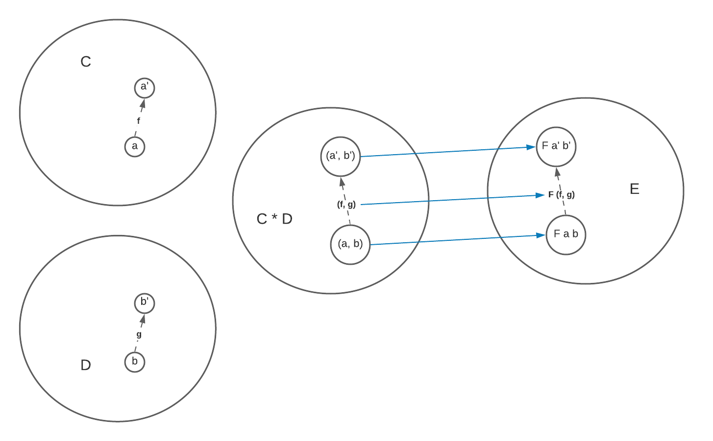
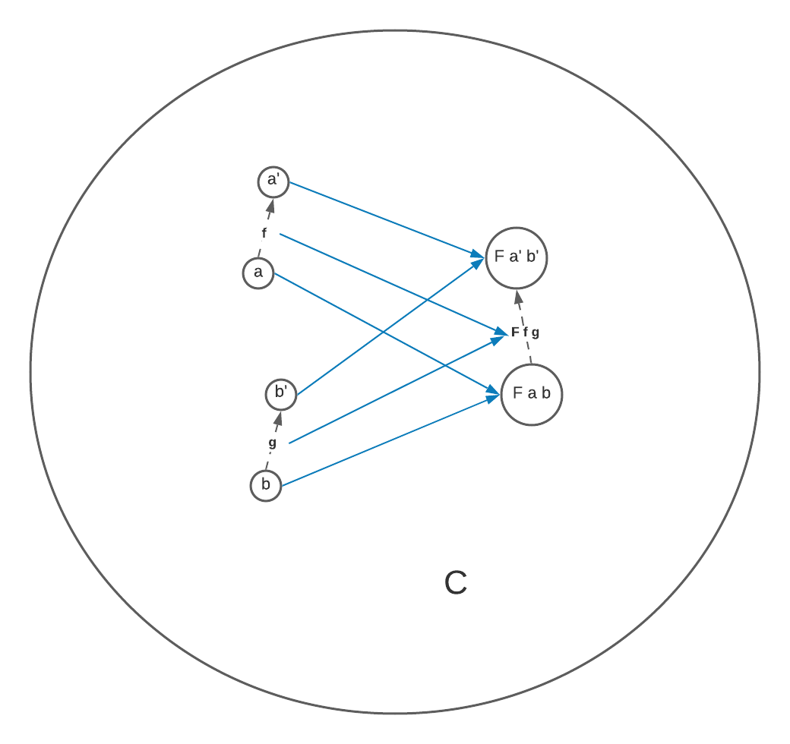

This is a note based on the lecture about [functoriality and bifunctors](https://youtu.be/pUQ0mmbIdxs). The same topic is also discussed in the [*Functoriality*](https://bartoszmilewski.com/2015/02/03/functoriality/) chapter from the book [*Category Theory for Programmers*](https://bartoszmilewski.com/2014/10/28/category-theory-for-programmers-the-preface/).

## What is discussed in this lecture?

This lecture discussed two main topics:

- What is a bifunctor
- product and coproduct are bifunctors, in both *Hask* and general categories

## What is a bifunctor?

A bifunctor maps two objects `\(a\)` and `\(b\)`, from categories `\(C\)` and `\(D\)`, respectively, to a new object `\(e\)` in category `\(E\)`.

Instead of defining a new concept from scratch, we reuse the concept of functors when defining bifunctors. We could define a new category `\(C \times D\)` whose objects are pairs of pairs of objects from `\(C\)` and `\(D\)`. As a result, `\(a\)` and `\(b\)` form a pair `\((a, b)\)` in `\(C \times D\)`. 

A functor maps not only the objects but also the morphisms between objects. Similarly, a bifunctor should also somehow map the morphisms. Suppose we have another pair of objects `\(a'\)` and `\(b'\)` which are represented by an object `\((a', b')\)` in `\(C \times D\)`, and we have `\(f\)` goes from `\(a\)` to `\(a'\)` and `\(g\)` from `\(b\)` to `\(b'\)`, we could thus define a new morphism called `\((f, g)\)` in `\(C \times D\)` which maps the first component of `\((a, b)\)` using its first component `\(f\)`, and the second component using `\(g\)`. Note that every morphism from `\((a, b)\)` to `\((a', b')\)` is constructed by picking one morphism from the morphisms between `\(a\)` and `\(a'\)`, and another one from the morphisms between `\(b\)` and `\(b'\)`. Therefore, if there are `\(m\)` morphisms between `\(a\)` and `\(a'\)`, and `\(n\)` between `\(b\)` and `\(b'\)`, there will be `\(m \times n\)` morphisms between `\((a, b)\)` and `\((a', b')\)`.

A bifunctor, as a result, is defined as a functor `\(F\)` from `\(C \times D\)` to `\(E\)`, which maps `\((a, b)\)` to `\(F a b\)` and `\((a', b')\)` to `\(F a' b'\)`. It also preserves the morphism structure by mapping `\((f, g)\)` to a morphism `\(F (f, g)\)` between `\(F a b\)` and `\(F a' b'\)`.

However, we usually deal with a single category when working on *Hask*, so actually both `\(D\)` and `\(E\)` are the same as `\(C\)`. Therefore, we could think of a bifunctor as one which takes two objects `\(a\)` and `\(b\)` and maps them to another object `\(F a b\)`. The bifunctor also maps two morphisms, `\(f\)` and `\(g\)`, to `\(F f g\)`.

## Products and coproducts are bifunctors

### *Hask*

A product in *Hask* is a bifunctor which maps `\(a\)` and `\(b\)` to `\((a, b)\)`, and `\(f\)` and `\(g\)` to `\((f, g)\)`. Or if we define it in terms of the product category (right side), it's just an `\(id\)` mapping.

Similarly, a coproduct in *Hask* is also a bifunctor which maps `\(a\)` and `\(b\)` to `\(a | b\)`. What is interesting is how it maps the morphisms. The coproduct bifunctor takes two morphisms `\(f\)` and `\(g\)`, and, based on whether the source object is `\(a\)` or `\(b\)`, apply `\(f\)` or `\(g\)` conditionally.

### General categories 

<strong>Theorem 1   (products are bifunctors) </strong>In a category where you have product defined for every pair of objects, this product is a bifunctor.

We have two objects `\(a\)` and `\(b\)` whose product is `\(a * b\)`, which means projection morphisms `\(p\)` and `\(q\)` from `\(a * b\)` to `\(a\)` and `\(b\)`, respectively. We also have `\(a'\)`, `\(b'\)` and `\(a' * b'\)`. Now we want to map the morphisms `\(f\)` and `\(g\)` to some other morphism in the category which maps `\(a * b\)` to `\(a' * b'\)`.  

We could consider `\(a * b\)` to be another candidate of the product of `\(a'\)` and `\(b'\)`. By the definition of product, there must be a unique morphism `\(h\)` from `\(a * b\)` to `\(a' * b'\)` such that `\(p' \cdot h = f \cdot p\)` and `\(q' \cdot h = g \cdot q\)`. Let's define `\(f * g\)` to be this `\(h\)`, and here is how the product bifunctor maps morphisms.

Similarly, coproducts are also bifunctors, see the figure below.

