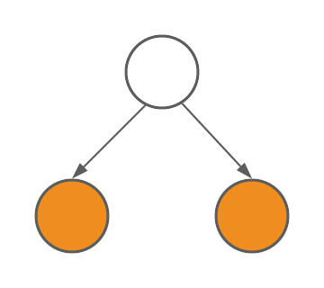
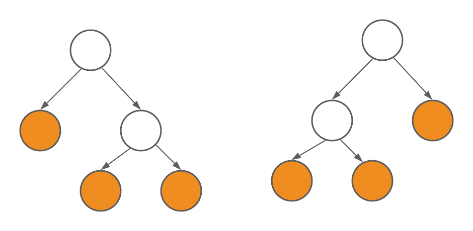

## Product Types

Just like we can do `\(+\)` and `\(\times\)` operations on numbers, we can also do them for types. We define the product of two types to be a pair. In Haskell, it's a pair `(a, b)`, like `(Int, Bool)`. In C++ we have a similar structure `std::pair`, which is also a product type.

Why a pair is called a product? We can make sense of it by counting possible values. Suppose we have 2 possible values for `Bool` and 256 for `Char`, how many possible values we have for `(Bool, Char)`? The answer is `\(2 \times 256 = 512\)`. Generally, if we have `\(n\)` possible value for type `a`, and `\(m\)` for type `b`, then `(a, b)` will have `\(n * m\)` possible values, that is why we denote `(a, b)` to be the *product* of `a` and `b`, or `a * b`. The counting method doesn't work if a type has infinitely many possible value, like `String`, but even in this case, we still call pairs product types.

### Commutativity and Associativity

We also have commutative law and associative law for product types. For example, `(a, b)` and `(b, a)` and not strictly the same -- they have different memory layouts, but they are isomorphic, which means there is a one-to-one function between them (here it's just the `swap` function which exchanges the first and second member of the pairs). In this case, commutative law still holds -- up to isomorphism. Similarly, associative law also holds, which means `((a, b), c)` and `(a, (b, c))` are isomorphic.

### Identity Element

The product operation for numbers has an identity element 1 such that `\(1 \times a = a\)` and `\(a \times 1 = a\)`. Note that product is commutative so it's sufficient to specify either `\(1 \times a = a\)` or `\(a \times 1 = a\)`. Do we also have such identity element for types? According to the approach of counting possible values, we want to find a type which has only one value. In fact, such a type is called a *unit type*. In Haskell the unit type is written as `()` and contains only one value: `()`. Similar types are `void` in C++, `NoneType` in Python (the corresponding value is `None`) and `Unit` in Scala (the value is `()`). 

Does `\(1 \times a = a\)` also holds for product types? Yes! It's easy to argue that `((), a)` and `a` are isomorphic. As a result, we say the set of types is a commutative monoid up to the product operation, and the unit type is the identity element.

## Sum Types 

Similar to product, we define the sum of two types as an `Either` type.

``` haskell
data Either a b = Left a | Right b
```

How can we make sense of it? Again, the counting method. Suppose we have `\(n\)` possible value for type `a` and `\(m\)` for type `b`, how many possible values we have for `Either a b`? The answer is `\(a + b\)`, so comes the name "sum types".

The sum of two types is also commutative and associative up to isomorphism, which means

``` haskell
Either a b ~ Either b a
Either (Either a b) c  ~ Either a (Either b c)
```

(`~` means isomorphic)

### Identity Element

What is the identity element corresponding to 0 in numbers? It should be a type with 0 possible values, so it's called the empty type. In Haskell it's `Void` and in Scala it's `Nothing`. A lot of languages do not have such type, like C++. Note that the type `void` in C++ is a unit type instead of an empty type. Here is the difference between Haskell `Void` and C++ `void`. 

In Haskell, we can define functions like this:

``` haskell
absurd :: Void -> a
```

Those `absurd` functions take type `Void` and returns any types. **You cannot actually call them**. Why? To call them you have to provide a value of type `Void`, but as we said, there is no such values because `Void` is empty. 

In contrast, a C++ function whose argument is `void` could be called, just like the `func` below.

``` c++
int func(void) {
    return 1;
}

int a = func();
```

Why? because you actually provide a special value, a value that is the only inhabitant of type `void` to the `func` function when calling it! 

Similarly, In Haskell you cannot define a function which returns `Void` -- because you cannot provide such a value to return! The Haskell equivalent of C++ functions returning `void` are functions returning `()`, the unit type.

In conclusion, C++ `void` is not an empty type but a unit type, and it's equivalent to Haskell `()` instead of `Void`.

Note that in other languages, we have functions returning the empty type and they can be useful. For example, in Scala a function returning `Nothing` is used for situations like exceptions (i.e. the function does not return normally). Note that from the mathematical perspective functions should always return, so the Scala way of returing `Nothing` is kind of a hack. Generally we still think that there is no functions returning an empty type.

Let's go back to sum type. `Void` is indeed the identity element for sum operation because `Either Void a` is isomorphic to `a` (there is no way to construct the `Left` version of `Either Void a` so it's essentially the same as `a`). As a result, the set of types is also a commutative monoid up to the sum operation, and the identity element is the empty type `Void`. 

## Summary of Product and Sum Types

Below is a table summerizing product and sum types.


| Name      | Numbers | Types|
| ----------- | ----------- | --------- |
| product | `\(a \times b\)` | `(a, b)`|
| sum   | `\(a + b\)`  | `Either a b = Left a \| Right b`|
| product commutative law | `\(a \times b = b \times a\)` | `(a, b) ~ (b, a)`|
| product associative law   | `\((a \times b) \times c = a \times (b \times c)\)`  | `((a, b), c) ~ (a, (b, c))`|
| product identity value  | `\(1 \times a = a\)`  | `((), a) ~ a`|
 sum commutative law | `\(a + b = b + a\)` | `Either a b ~ Either b a`|
| sum associative law   | `\((a + b) + c = a + (b + c)\)`  | `Either (Either a b) c  ~ Either a (Either b c)`|
| sum identity value  | `\(0 + a = a\)`  | `Either Void a ~ a`|
| distributive law | `\(a \times (b + c) = a \times b + a \times c\)`  | `Either a (b, c) ~ Either (a, b) (a, c)`|
| annihilating element  | `\(0 \times a = 0\)`  | `(Void, a) ~ Void`|


Considering that the set of types:
- is a commutative monoid up to the sum and product operations
- satisfies the distributive law
- the identity element of sum is also the annihilating element of product

We get the conclusion that *the set of types is a __semiring__*.

## Interesting data types

Here are some interesting correspondence between algebraic expression and data types

| Numbers | Types|
| -------- | ---- |
|$1 + 1 = 2$| `data Bool = True \| False`|
|$1 + a$| `data Maybe = Nothing \| Just a`|
|$a + a = 2 \times a$| `Either a a ~ (Bool, a) ` |
|$\underbrace{a + a + \cdots + a}_{n} = n \times a$|`Either a a ... a ~ (<a type of n values>, a)`|

In the table above, `True`, `False` and `Nothing` are all unit types because they contain only one value. If we are to define `Bool` and `Maybe` using `Either`, The definition will be

``` Haskell
data Bool = Either () ()
data Maybe a = Either () a
```

### List

A more interesting example is `List`, since it's a recursive type

``` haskell
List a = Nil | Cons a (List a)
```

Such recursive types are equivalent to equations. For example, below is the corresponding equation of `List`. We just replace `List a` with `\(x\)`.

$$
x = 1 + ax
$$
The solution of this equation is `\(x = \frac{1}{1-a}\)`. How to make sense of it? We did not define subtraction or division for types, so we should convert it to another form. Notice that `\(\frac{1}{1-a}\)` is the result of geometric series. As a result, we get

$$
`\begin{aligned}
x &= \frac{1}{1-a} \\
&= 1 + a + aa + aaa + \cdots
\end{aligned}`
$$
The same equation could be obtained using Taylor series. Remember the Taylor series for `\(f(x)\)` at point `\(x_0 = 0\)` is

$$
f(x) = f(0) + \frac{f'(0)}{1!}x + \frac{f''(0)}{2!}x^2 + \frac{f'''(0)}{3!}x^3 + \cdots
$$
If it does not make sense to you, you can also expand manually which gives the same result.

$$
`\begin{aligned}
x &= 1 + ax \\
&= 1 + a(1 + a \times x) = 1 + a + aax \\
&= 1 + a + aa(1 + ax) = 1 + a + aa + aaax \\
&= 1 + a + aa + aaa + \cdots
\end{aligned}`
$$
What does it mean? It means a list is either empty (1), or a single element ($a$), or two elements ($aa$), or three elements ($aaa$), etc. 

Or, in Haskell, someything like the following

``` haskell
List a = Nil 
        | Cons a Nil 
        | Cons a (Cons a Nil) 
        | Cons a (Cons a (Cons a Nil)) 
        | ... 
```

### Binary Tree

Another example is the definition of binary trees

``` haskell
data BinaryTree a = Leaf a | Branch (BinaryTree a) (BinaryTree a)
```

The equivalent expression for numbers is

$$
x = a + x^2
$$
which expands to (either by Taylor series or manually)
$$
x = a + a^2 + 2a^3 + 5a^4 + \cdots
$$

It means, a tree is either 
- a single leaf ($a$)
- a tree with 2 leaves ($a^2$)

- one of the two trees with 3 leaves ($2a^3$)

- etc. 

## Algebratic Data Types for other languages

In C++, besides representing a product type with `std::pair`, we can also use a `struct` or `class`. For example, the following is the product of `int` and `bool` and it's isomorphic to a `pair<int, bool>`.

``` c++
class Foo {
    int a;
    bool b;
}
```

As for sum types, there are a lot of different ways to represent them in C++, for example:
- Special values like negative values or null pointer could be used to represent `Maybe`
- Enum types are another example of sum types, where every enum value is equivalent to a unit type
- [`std::variant`](https://en.cppreference.com/w/cpp/utility/variant) is used to simulate `Either`
- As an object oriented language, C++ also use subclasses to represent sum types. For example, say we have a base class `Shape` and two subclasses `Circle` and `Square`, it's equivalent to `data Shape = Circle | Square`

In Scala, we mainly use case classes to represent product types and inheritance to represent sum types. For example, below is the definition of `List` in Scala where `List` is the sum of `Nil` and `Cons`, while `Cons` is the product of type `A` and a list.

``` scala
sealed trait List[+A]

case object Nil extends List[Nothing]
case class Cons[+A](head: A, tail: List[A]) extends List[A]
```

While being a functional language, Scala defines algebratic data types using a different form than Haskell, that is because Scala is also an object oriented langauge.

## Function Types and Exponentials

We already know that functions also have types. A function taking type `a` and returning `b` can be denoted as `a -> b`. Note that here we only consider pure functions with only one argument. Functions with multiple arguments could be obtained by currying. So how does function types fit into algebratic data types? 

The answer might be surprising: function types are exponentials! In fact, the function type `a -> b` could be represented as `\(b^a\)`. 

Why? Here comes our old friend -- counting possible values. Say we have type `Bool` which has 2 possible values, and type `Char` which has 256. How many possible functions are there from `Char` to `Bool`? The answer is `\(\underbrace{2 \times 2 \times 2 \cdots \times 2}_{256}\)`, or `\(2^{256}\)`. Generally, there are `\(m^n\)` possible functions from a type `a` with `\(n\)` values to a type `b` with `\(m\)` values, so the function type `a -> b` are denoted as `\(b^a\)`. Even if there might be infinitely many inhabitants we still denote it as an exponential.

Below are the interesting laws about function types.

| Name      | Numbers | Types| Description |
| ----------- | ----------- | --------- | -------- |
| 0th power | `\(a^0 = 1\)` | `Void -> a ~ Unit`| There is only one function from `Void` to any type `a`, i.e. the `absurd` function. |
| power of 0 |  `\(0^a = 0\)` |  | There are no functions returning `Void` |
| 1st power  | `\(a^1 = a\)`  | `() -> a ~ a`| Each function from unit to a type `a` selects an element from `a` |
| power of 1   | `\((1^a = 1)\)`  | `a -> () ~ Unit`| There is only one function from any type to `()`|
| 2nd power | `\(a^2 = a \times a\)`  | `Bool -> a ~ (a, a)`| First element defines the mapping for `True`, and second element defines the mapping for `False`|
| nth power  | `\(a^n = \underbrace{a \times a \cdots \times a}_{n}\)`  | `<a type containing n elements> -> a ~ (a, a, ... a)`|
| exponentials of sums | `\(a^{b+c} = a^b\times c^c\)` | `Either a b -> c ~ (a -> c, b -> c)`|
| exponentials over exponentials   | `\((a^b)^c = a^{b\times c}\)`  | `c -> b -> a ~ (b, c) -> a`| function currying |
| exponentials over products  | `\((a \times b)^c = a^c \times b^c\)`  | `c -> (a, b) ~ (c -> a, c -> b)`|

## Conclusion

There is magical similarities between type algebra and number algebra. The similaries come from that we could define types algebraically, using constructs like sum, product and exponential.

## Further Readings

I recommend the book (in the form of a series of blog posts) [Category Theory for Programmers](https://bartoszmilewski.com/2014/10/28/category-theory-for-programmers-the-preface/) and the [lecture videos](https://youtube.com/playlist?list=PLbgaMIhjbmEnaH_LTkxLI7FMa2HsnawM_) (by the same author) if you want to learn more.

