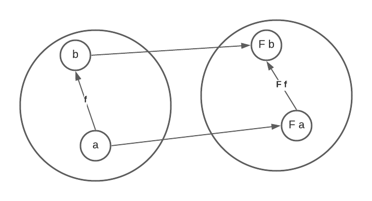
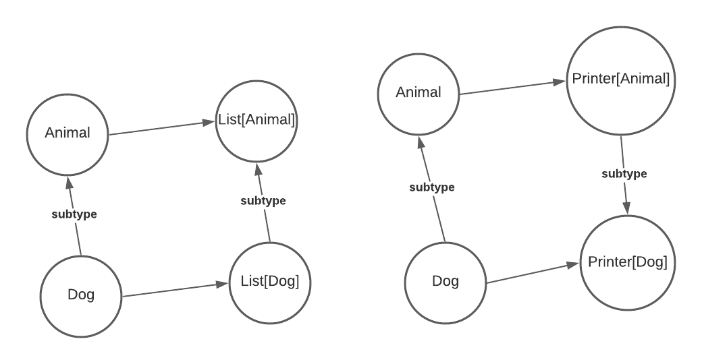

## Covariance and Controvariance for generics

Generic classes can be made covariant or contravariant. An example of  covariant class is `List`, which could be declared as the following. (Taken from chapter 3 of [Functional Programming in Scala](https://learning.oreilly.com/library/view/functional-programming-in/9781617290657/))

``` scala
sealed trait List[+A]

case object Nil extends List[Nothing]
case class Cons[+A](head: A, tail: List[A]) extends List[A]
```

Notice the `+` sign in `List[+A]`, which means `List` is covariant. For example, if we have `Cat` and `Dog` extending from `Animal`, `List[Dog]` and `List[Cat]` will be subtypes of `List[Animal]`. Also note that the object `Nil` extends from `List[Nothing]`, which makes it a subclass of `List[Dog]`, `List[Cat]`, or any other `List[A]` because `Nothing` is the subtype of all types. 

An example of contravariance in Scala is the following `Printer` examples. (Taken from [Tour of Scala](https://docs.scala-lang.org/tour/variances.html))

``` scala
abstract class Printer[-A] {
  def print(value: A): Unit
}

class AnimalPrinter extends Printer[Animal] {
  def print(animal: Animal): Unit =
    println("The animal's name is: " + animal.name)
}

class CatPrinter extends Printer[Cat] {
  def print(cat: Cat): Unit =
    println("The cat's name is: " + cat.name)
}
```

It turns out that a `Printer[Animal]` can be used wherever a `Printer[Cat]` is required, as is shown below

``` scala
def printMyCat(printer: Printer[Cat], cat: Cat): Unit =
  printer.print(cat)

val catPrinter: Printer[Cat] = new CatPrinter
val animalPrinter: Printer[Animal] = new AnimalPrinter

printMyCat(catPrinter, Cat("Boots"))      // The cat's name is: Boots
printMyCat(animalPrinter, Cat("Boots"))   // The animal's name is: Boots
```

As a result, `Printer[Animal]` is actually a subtype of `Printer[Cat]`, and that is why we 
we make `Printer` a contravariant generic class.

### The *get-put principle*

The covariance and contravariance of generic classes follow the *get-put principle* (from the book [Java Generics and Collections](https://learning.oreilly.com/library/view/java-generics-and/0596527756/)), which says we use covariance when we only *get* values from a structure, and use contravariance when we only *put* to it. An example in Java looks like the following.

``` java
public class Collections { 
  public static <T> void copy(List<? super T> dest, List<? extends T> src) {
      for (int i = 0; i < src.size(); i++) 
        dest.set(i, src.get(i)); 
  } 
}
```

In the example above, we get values from `src` with `src.get()` and `put` values to `dest` with `dest.set()`, so we use `extends` for `src` (covariance) and `super` for `dest` (contravariance).

In Scala, the get-put principle also holds. `List` is immutable and we only `get` values from it, so it's made a covariant class. For `Printer` it's a little tricky. `Printer` classes doesn't store objects, but we can still think of the `print` method to be kind of a `put` operation since it takes a parameter of type `A`. As a result, the `Printer` classes is contravariant.

Notice the difference of Java and Scala generics: In Java we declare whether a generic class is covariant or contravariant when we declare variables of the class (using `super` or `extends`), but in Scala we do it when we define the class (using `+` or `-`). As a result, in Java a class can sometimes be covariant and sometimes be contravariant, like the `List` class in the Java `copy` example above, but in Scala, a class can only be either covariant or contravariant (or, of course, invariant) consistently. 

### A caveat in Java

Consider the Java code below

``` java
Integer[] ints = new Integer[]{1,2,3};
Object[] objects = ints;
objects[2] = 3.14;
```

Think about the following questions:

- Does the code compile? Does the code run correctly?
- At which line will an error happen?
- What is the root cause of the error? If we could redesign Java, at which line should an error happen?

Here is the answer. The code compiles but it doesn't run correctly, a `java.lang.ArrayStoreException` will be thrown at line 3. The apparent problem is that we put a double into an array of integers, but the root problem happens at line 2: We are able to assign an `Integer[]` to an `Object[]` (i.e. arrays are considered covariant) even when we will `put` to the array subsequently at line 3! According to the get-put principle, in this case we should not consider arrays as covariant. It turns out Java (incorrectly) thinks arrays as covariant but they do not always behave covariantly. So if we could redesign Java we should made arrays invariant (it's hard to provide `super`, `extends` like syntax for arrays because arrays do not use `<>`), which means line 2 should get a compile time error (because `Object[]` is not a subtype of `Integer[]`). In Scala the class `Array` is invariant, which solves this issue in Java.

## Covariance and Contravariance for functors

Functors can also be covariant or contravariant. Consider the following type constructor `List` in Haskell.

``` haskell
data List a = Nil | Cons a (List a)
```

It's a covariant functor because we could define a function `fmap` which takes a function from `a` to `b` and returns another function from `List a` to `List b`.

``` haskell
fmap :: (a -> b) -> (List a -> List b)
```

This is the definition of `fmap`

``` haskell
instance Functor List where
    fmap _ Nil = Nil
    fmap f (Cons x t) = Cons (f x) (fmap f t)
```

A contravariant functor is, by contrast, a type constructor `f` which we could define a `contramap` taking a function `b -> a` and returning another one `f a -> f b`.

``` haskell
contramap :: (b -> a) -> (f a -> f b)
```

An example of contravariant functors is the so called Writer type, which is essentially a function when the return type is fixed, or, `Op r` as defined below.

``` haskell
type Op r a = a -> r
```

The `contramap` is defined as

``` haskell
instance Contravariant (Op r) where
    -- (b -> a) -> Op r a -> Op r b
    -- here f is the b -> a and g is the Op r a (or a -> r)
    contramap f g = g . f
```

Notice that `f` applies before `g`. Since `f` is `b -> a` and `g` is `Op r a` (or `a -> r`) and the result type is `Op r b` (or `b -> r`), we should apply `f` first to convert `b` to `a` and then `g` which converts `a` to `r`. In other words, the `contramap` function of the writer type "inserts" the function `b -> a` before the function `a -> r`.

## Covariance and Contravariance, categorically

We know that in category theory, a functor is a mapping between categories that preserves their structures. A functor `\(F\)` between two categories is shown below.



However, in programming we generally have only one category. Below is how covariant and contravariant functors work in only one category. A covariant functor maps `a -> b` to `F a -> F b`, and a contravariant functor maps `a -> b` to `F b -> F a`.


Note that the word _functor_ is used in both category theory and functional programming. To avoid confusion I refer to functors in category theory as _categorical functors_. When a single word _functor_ is used, it means functors in functional programming.

Below is how covariant and contravariant functors work from the categories perspective. Here the objects are types (like `Int` and `String`) and the morphisms are functions between types (there are a lot of morphisms between `Int` and `String`, but only `parseInt` is shown as an example). In this example, both `List`  and `Op Bool` (`a -> Bool`) are categorical functors.


The `List` categorical functor maps any function `f :: a -> b` to `fmap f :: List a -> List b` by applying function `f` to every element of the list. It preserves the direction of morphisms so it's covariant. In contrast, the `Op Bool` categorical functor maps any function `f :: a -> b` to `contramap f :: (b -> Bool) -> (a -> Bool)` by "inserting" itself before the `b -> Bool` function. It reverses the direction of morphisms so it's called contravariant.

On the other hand, below is how covariant and contravariant generics work. Here the objects are still types, but the morphisms are subtype relations. In contrast to functors, there are only at most one morphism between objects in this category. In this example, both `List`  and `Printer` are categorical functors, but works on a different category than the example above.



The `List` categorical functor maps any subtype relation `a < b` to `List[a] < List[b]` (here `<` means "subtype of"). It preserves the direction of morphisms so it's covariant. In contrast, the `Printer` categorical functor maps any relation `a < b` to `Printer[b] < Printer[a]`. It reverses the direction of morphisms so it's called contravariant.

In conclusion, Both functors and generic classes are actually categorical functors, and the words _covariant_ and _contravariant_ in both functors and generics essentially describe the covariance/contravariance of the underlying categorical functors. However, they work on different categories. **For functors the morphims are functions but for generics the morphisms are subtype relations**.


