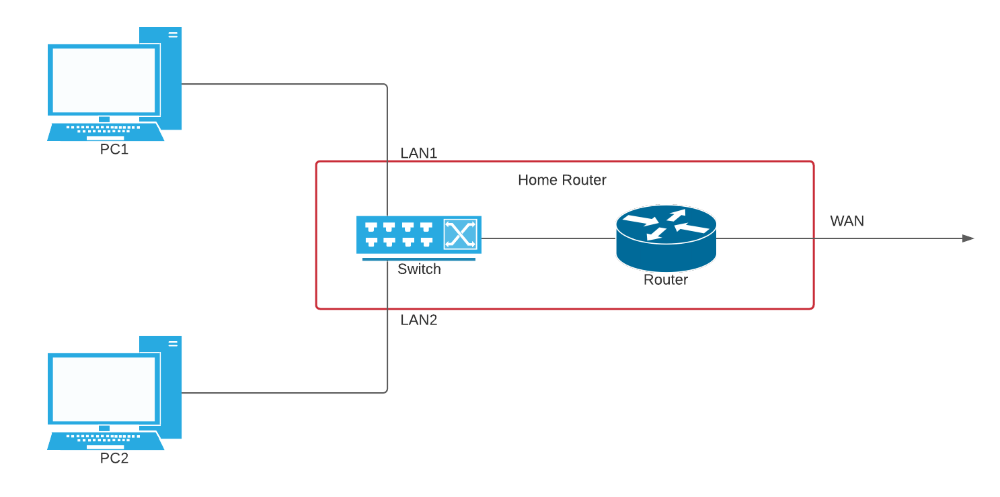
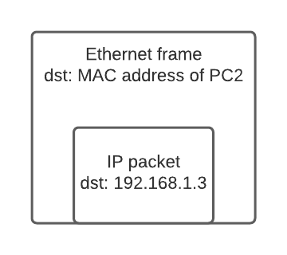
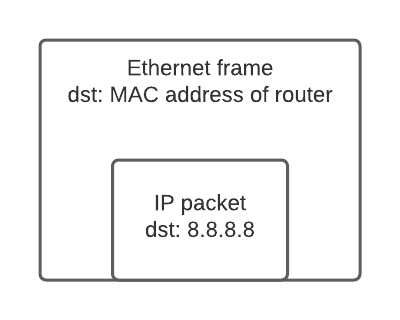

*Routing* is a process that determines the output interface of an IP packet by matching its destination address. Other information could also be set during routing, like the gateway address of the packet. The routing process is generally configured by *route tables*, which is shown using the command `ip route`. 

## Home network configuration

Below is a typical configuration for a home network, where the two machine (PC1 and PC2) are in a local network (`192.168.1.0/24`) and they connect to the Internet by a router. Note that here I show two PCs, but actually they could be any devices (mobiles phones, TVs, or gaming consoles, etc.) and there could be any number of them.


You might be wondering: Oh I do not have a switch at home! In fact, the typical home routers have a switch embedded. All machines connected to a LAN interface are connected to the embedded switch, which in turn connects to a router port. The WAN interface is connected to the other router port. Note that the router in typical home routers has only two ports, so it only creates two networks: the local network and the public network.



What will the route table on PC1 look like? Possibly the following (simplest case)

``` sh
192.168.1.0/24 dev eth0  # rule for local network
default via 192.168.1.1 dev eth0   # rule for public network
```

The first rule directs all traffic whose destination matching `192.168.1.0/24` to `eth0`, and the second rule directs traffic matching `0.0.0.0/0` (`default` is the alias for `0.0.0.0/0`) to the same interface, with the gateway address `192.168.1.1`. The route table rules follow the "longest prefix match" law. For example, a packet goes to `192.168.1.3` matches both the first and second rule (the second rule matches any IP addresses since its prefix is `/0`), but the first rule is selected since it has a longer prefix length (`24 > 0`). As a result of the longest prefix law, the route table above sends all local network traffic to rule 1, and all other traffic (public network traffic) to rule 2. The difference between the two rules is that rule 2 has a `via` keyword.

What does the keyword `via` mean in the second rule? The address after `via` is called *gateway*. Basically, for addresses in the same local network, we do not have a gateway (like the first rule). While for addresses which are in a different network, we set the gateway to the address of the router (like the second rule). Let me explain the difference.

## Local network traffic

For route table rules without a gateway, the destination machine must be in the same network as the sending machine. Below is the example of sending a packet from PC1 to PC2. This traffic matches the first rule in the route table, which doesn't have a gateway address. In this case, PC1 assembles the Ethernet frame by putting the MAC address of PC2 as the destination address. 



Note that in this case, the destination MAC address and the destination IP address point to the same device: PC2.

What if PC1 doesn't know PC2's MAC address? In this case PC2 finds the MAC address of PC2 by the *ARP (Address Resolution Protocol)* protocol. It works like the following steps:

1. PC1 broadcasts an ARP request to the local network, which asks all other hosts: *Who is `192.168.1.3`?* PC1's own MAC address is also included in the request so the recipient knows where to send the response.
2. PC2 answers PC1: *Hey, I am `192.168.1.3` and this is my MAC address!* 
3. PC1 sets the MAC address in the answer as the destination MAC address of the enclosing Ethernet frame.

An important detail is that the ARP table (the table which maps IP address to their corresponding MAC addresses) is not stored at the switch. A switch works at layer 2 (data link layer), which means it doesn't have the knowledge of IP addresses. Instead, the ARP tables are stored at the devices connecting to the switch. In our case, PC1, PC2 and the router.

## Traffic to other networks

So what if PC1 sends a packet to a different network? Here is an example of sending a packet from PC1 to a public IP address (say, `8.8.8.8`). This traffic matches the second rule in the route table. This rule is equipped with a gateway address, which is the address of the router, `192.168.1.1`. In this case, PC1 sets the destination MAC address of the Ethernet frame to the MAC address of the gateway (`192.168.1.1`). If the MAC address is not known yet, PC1 finds it by the ARP protocol. There is no way for PC1 to know the MAC address of the destination machine. If it tried to look for `8.8.8.8` by ARP no one would answer because this IP is not even in the local network.



Note that in this case, the destination MAC address and the destination IP address point to different devices. The MAC address points to the router, which inspects the enclosed IP packet upon receiving this frame. The router then finds that this packet is not destined to itself, and sends it out to the public network via `eth0`.

Note that it illustrates the difference between a host and a router. A host (like PC1 and PC2) usually only receive and process packets destining itself, while a router typically handles packets destining other devices (there are also traffic destining a router, like when you manage the router's configuration via a web console, but usually packets are destined to other devices). 

In this article we explained the general structure of a route table and the usage of the gateway address. Route table rules also have other fields like `scope` and `src`, you can take a look at [the manual](http://linux-ip.net/html/tools-ip-route.html).