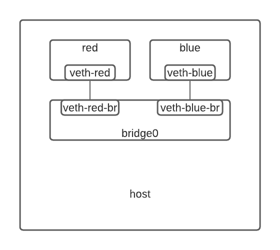
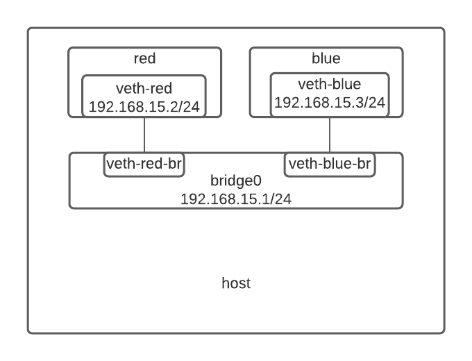

## Prerequisites

The video [Network Namespaces Basics Explained in 15 Minutes](https://youtu.be/j_UUnlVC2Ss) is a good introduction to how Linux network namespaces work. However, this video has several mistakes, so getting a basic idea of the command line is sufficient.

## Set up the environment
To experiment with the content in this article, you need a Linux machine. If you don't have Linux installed, a virtual machine also works well. You can also use my Github repository [network-namespace-experiment](https://github.com/stackunderflow101/network-namespace-experiment), which provides a minimal Vagrantfile and the scripts to do the experiment.

We can set up two network namespaces connected to a bridge with the following commands:

```shell
# two namespaces
ip netns add red
ip netns add blue
# the bridge connecting the two namespaces
ip link add bridge0 type bridge
# the veth pair connecting red namespace to the bridge
ip link add veth-red type veth peer name veth-red-br
ip link set veth-red netns red
ip link set veth-red-br master bridge0
# turn the interfaces up
ip -n red link set veth-red up
ip link set veth-red-br up
# do the same for blue namespace
ip link add veth-blue type veth peer name veth-blue-br
ip link set veth-blue netns blue
ip link set veth-blue-br master bridge0
ip -n blue link set veth-blue up
ip link set veth-blue-br up
# turn the bridge up
ip link set bridge0 up
```

The namespaces `red` and `blue` are connected to a bridge, `bridge0`, like the diagram below.



## Network namespaces communication

How can the two network namespaces, `red` and `blue`, communicate with each other? The answer is: we need to assign IP addresses to them. The following commands assign 192.168.15.2/24 to `red` and 192.168.15.3/24 to `blue`.

```shell
ip -n red addr add 192.168.15.2/24 dev veth-red
ip -n blue addr add 192.168.15.3/24 dev veth-blue
```

`ping` to `blue` from `red` to verify that it works.

``` shell
ip netns exec red ping 192.168.15.3
```

How does it work? It turns out that a routing rule is added to the route table of `red` automatically when assigning it the IP address `192.168.15.2/24`

```shell
192.168.15.0/24 dev veth-red scope link
```

The routing rule has no gateway address, and the `scope` is set to `link`. This is exactly what the network prefix `/24` in the IP address 192.168.15.2/24 implies: All the addresses in the `192.168.15.0/24` range could be reached directly from interface `veth-red`, without going through any routers.

The same goes for network namespace `blue`, where the following routing rule is added automatically.

```shell
192.168.15.0/24 dev veth-blue scope link
```

This is exactly how Docker [bridge network](https://docs.docker.com/network/bridge/) works. The difference is that the default Docker bridge is called `docker0` instead of `bridge0`, which is created when the daemon `dockerd` starts.

## Network namespaces and host communication

To communicate with the host, we have to assign an IP address to the bridge0 interface.

```shell
ip addr add 192.168.15.1/24 dev bridge0
```

Now we can reach the network namespaces from the host
```shell
ping 192.168.15.2
```

and the host can be reached from the network namespace using the IP address of the bridge.
```shell
ip netns exec red ping 192.168.15.1
```

This is exactly how Docker enables container-to-host communication for bridge networks. See [this question](https://stackoverflow.com/a/31328031/15293404) for more details.

## What are separated by network namespaces?

From the output of `ip link` from both the host and the `red` namespace (`ip -n red link`) we see that network interfaces are separated. Moreover, other networking configurations, like route table (shown by `ip route`) and iptables are also separated. Therefore, network namespaces are like separate machines to the host. 

Notice that Docker (and other container tools) use several namespaces in combination. In addition to network namespaces, they use PID namespaces, mount namespaces, UTS namespaces, etc. However, for this article, we only care about network namespaces. To learn about other namespaces, you can find resources in [Containers Deep Dive](/p/containers-deep-dive/).

## What is a virtual bridge?

The configuration becomes the following after IP addresses are added.



You might wonder what a bridge is and why a bridge is added by the `ip link` command, which is normally used to manage network interfaces. The word "bridge" is just a synonym for "switch", and a virtual bridge is a bridge + an interface. The setup above is equivalent to the following physical network setup.


The name `bridge0` appears twice: It's not only the bridge connecting `red`, `blue`, and the host machine together, but also the interface that connects to the bridge on the host machine. In other words, it's a bridge from the perspective of the network namespaces, but it's an interface from the perspective of the host machine. When we add an IP address to `bridge0` using `ip addr add 192.168.15.1/24 dev bridge0`, we are actually adding an IP address to the interface. It's crucial to understand the "double roles" of a virtual bridge.

In [Home network configuration](/p/route-tables-explained/#home-network-configuration), I said that a typical home router has a switch built-in. Actually the switch is usually a virtual bridge managed by software instead of a physical switch.

## Access the Internet from a network namespace

To access the Internet from `red`, first we add a default routing rule which sends non-local traffic to the host machine.

```shell
ip -n red route add default via 192.168.15.1 dev veth-red
```

We should also set up NAT in the host machine. According to [SNAT in iptables](/p/iptables-for-routing/#snat-in-iptables), the rule should look like the following (`!` stands for negation).

```shell
iptables -t nat -A POSTROUTING -s 192.168.15.0/24 ! -o bridge0 -j MASQUERADE
```

Instead of specifying a particular output interface, we use the "!" sign to specify "any interfaces that are not bridge0". This is because the name of the output interface on different machines might be different, and a machine might even have more than one output interface (for example, a laptop might have both wired and Wi-Fi interfaces).

Then, run the following `ping` command to verify `red` has Internet access.

```shell
ip netns exec red ping 8.8.8.8
```

If it doesn't work, turn on the kernel parameter `net.ipv4.ip_forwarding` and try again.

```shell
sysctl -w net.ipv4.ip_forward=1
```

This is exactly how Docker containers access the Internet. In summary, we need 

- a default routing rule sending traffic to the host machine
- a MASQUERADE rule in the host machine setting up source NAT
- `net.ipv4.ip_forward=1`

Docker sets up the MASQUERADE rule and the parameter `net.ipv4.ip_forward=1` when `dockerd` starts, and the default routing rule is configured when a container starts.

### Hosts as routers

Why do we need the kernel parameter `net.ipv4.ip_forwarding=1`? It turns out that it's because the host machine should act as a router. Remember that routers are devices that accept traffic that does not go directly to themselves. In our scenario, the host machine takes traffic from 192.168.15.2 destining 8.8.8.8, but its own IP address is 172.16.94.12, neither the source address nor the destination address. Hence it acts as a router. The difference between the host and a regular router is that instead of routing traffic for physical machines, the host routes traffic for network namespaces running on itself. 

`net.ipv4.ip_forward` is the parameter controlling whether the host could act as a router. To set the parameter, use the following command.

```shell
sysctl -w net.ipv4.ip_forward=1
```

`sysctl` is the command to read and write Linux kernel parameters. Do not confuse it with `systemctl`, which is used to interact with `systemd`.

`sysctl` doesn't preserve the configuration if you reboot your machine. To set it permanently, add a file under `/etc/sysctl.d/` (like `/etc/sysctl.d/99-docker.conf`), and add the following line to this file.

```shell
net.ipv4.ip_forward=1
```

In this way, `systemd` will set this parameter at boot time.

## Publish a port

Let's run a web server in `red` on port 80

```
ip netns exec red python3 -m http.server 80
```

How to access it from port 8080 on the host?

### Different machine access

We need the following DNAT rule for port 8080 to be accessible from a different machine on the same network as the host, according to [DNAT in iptables](/p/iptables-for-routing/#dnat-in-iptables).

```shell
iptables -t nat -A PREROUTING -p tcp --dport 8080 -j DNAT --to-destination 192.168.15.2:80
```

### Host access

To be able to access the published port locally from the host, we need the following according to [Router access](/p/iptables-for-routing/#router-access):

```shell
iptables -t nat -A OUTPUT -p tcp --dport 8080 -j DNAT --to-destination 192.168.15.2:80
iptables -t nat -A POSTROUTING -m addrtype --src-type LOCAL -o bridge0 -j MASQUERADE
sysctl -w net.ipv4.conf.bridge0.route_localnet=1
```

Suppose your machine is connected to the Internet using an interface whose IP address is 10.0.2.15 (this is the default for virtual machines on VirtualBox), now access the published port by `curl 192.168.15.1:8080`, `curl 10.0.2.15:8080` and `curl 127.0.0.1:8080` to make sure everything works well.

What we have added are

- a DNAT rule in the OUTPUT chain
- a SNAT rule to correct the source address of packets sending to the network namespaces so that we can access the published port through addresses other than `bridge0`, such as 127.0.0.1 or 10.0.2.15
- `route_localnet`, which allows localhost addresses to pass reroute-check

See [Router access](/p/iptables-for-routing/#router-access) for why we need them.

### Access from `blue` namespace

Try running `ip netns exec blue curl 192.168.15.1:8080` and we get no response. Why?

The answer is simple: According to [Hairpin NAT](/p/iptables-for-routing/#hairpin-nat), what happens are:

1. `blue` sends a request packet to 192.168.15.1:8080, whose source address is 192.168.15.3
2. The destination address gets translated to 192.168.15.2:80, and the packet gets sent to `red`
3. `red` replies to `blue`, but the reply packet goes to `blue` directly through `bridge0` without going through iptables. As a result, the source address of the reply packet is 192.168.15.2, without being corrected by reverse NAT
4. `blue` gets the reply packet, but will not put the request and the response into the same connection since the source address of the response does not match the destination address of the request

How to solve the problem? It turns out that we do not need to turn on hairpin NAT for virtual bridges. Instead, what we need is to set a kernel parameter to 1.

```shell
sysctl -w net.bridge.bridge-nf-call-iptables=1
```

If the command above fails, your system might not have the kernel module `br_netfilter` loaded. Load the module and retry.

```shell
modprobe br_netfilter
```

Similar to `sysctl`, we can create a file under `/etc/modules-load.d` and write the following to the file for `systemd` to load the module at boot time:

```shell
br_netfilter
```

By the way, this is exactly [how we configure prerequisites for `containerd`](https://kubernetes.io/docs/setup/production-environment/container-runtimes/#containerd). The standard configuration also adds `net.bridge.bridge-nf-call-ip6tables=1` for ipv6 support, and an additional kernel module `overlay` for overlay filesystem.

When this parameter is set, iptables rules will be applied to packets going through virtual bridges. In this way, the reply packet will also go through the reverse operation of DNAT, and its source address will be corrected to match the destination of the request.


I also want to call out that packets from the network namespaces like `blue` or `red` go through the PREROUTING chain instead of the OUTPUT chain, even though the namespaces run on the host machine. This is because the host machine treats the network namespaces as if they are different machines. That is why the PREROUTING chain rule in [Different machine access](#different-machine-access) is required even when we do not enable other machines on the same network as the host to access the published port.

### Same namespace access

What if we access the exposed port from the namespace `red`? 

```shell
ip netns exec red curl 192.168.15.1:8080
```

We get no response. The option `net.bridge.bridge-nf-call-iptables` does not work for  access from the same namespace since the reply does not even go through the bridge, so the hairpin NAT rule is needed (See [Hairpin NAT](/p/iptables-for-routing/#hairpin-nat)):

```shell
iptables -t nat -A POSTROUTING -s 192.168.15.2 -d 192.168.15.2 -p tcp --dport 80 -j MASQUERADE
```

Try `curl` again, and it still doesn't work. It turns out we have to set `hairpin mode` for the bridge, `bridge0`. When we connect to port 8080 on the host from `red`, the packets arrive `bridge0` through interface `veth-red-br` and get routed back through the same interface by our DNAT rule. The bridge will reject such "going back" routing if `veth-red-br`'s hairpin mode is not turned on. To turn it on:

```shell
ip link set veth-red-br type bridge_slave hairpin on
```

Now, try `ip netns exec red curl 192.168.15.1:8080` and it works!

### Experiment with Docker

We described how Docker [publishes ports](https://docs.docker.com/config/containers/container-networking/#published-ports) above when the option `userland-proxy` is set to `false`. However, the default value is `true`. I will explain the difference later, and let's see how to configure this option for Docker.

First, set `userland-proxy` to `false` in file `/etc/docker/daemon.json` (create one if not exist).

```json
{
    "userland-proxy": false
}
```

Then, restart `dockerd` (the easiest way is to restart your computer).

Finally, run a container to experiment using 

```shell
docker run --rm -it -p 8080:80 nginx
```

You can try everything we explained above, including kernel parameters, virtual bridge settings, route tables, and iptables rules. For example, we can inspect the iptables rules using 

```shell
iptables -vL -t nat
```

What is the `userland-proxy` option? It's an alternative way to publish ports. When its value is `true`, Docker will start a proxy listening on published ports and redirect the traffic to the desired container. For example, for the `nginx` container above, it will listen on 0.0.0.0:8080 and redirect the traffic to 172.17.0.2:80 (Suppose `nginx` runs in such IP address). Setting `userland-proxy` to `false` triggers some bugs and compatibility issues in older kernels, so Docker keeps the default option to be `true`. You can see the discussion in [this issue](https://github.com/moby/moby/issues/14856). When the value is `true`, the iptables rules are slightly different from what we have shown above since we describe an iptables-only approach.

## Recommended resources

[Container Networking From Scratch](https://youtu.be/6v_BDHIgOY8)

