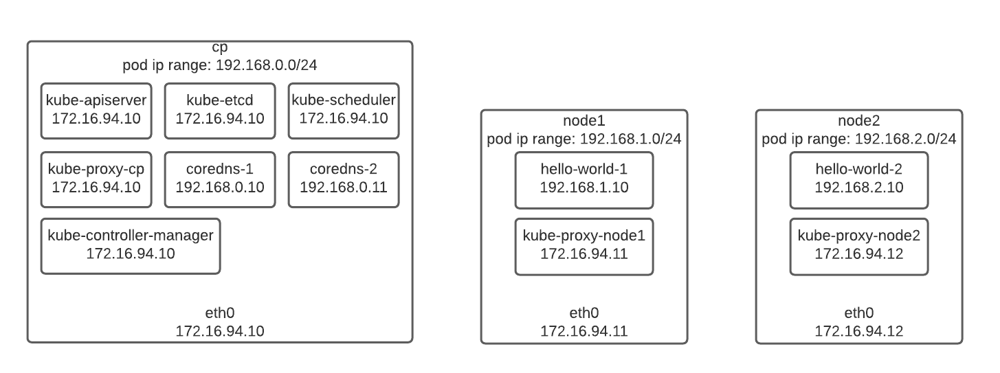
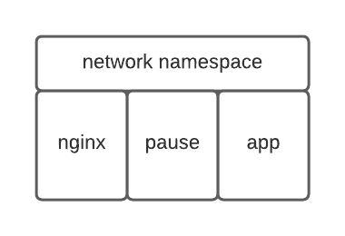
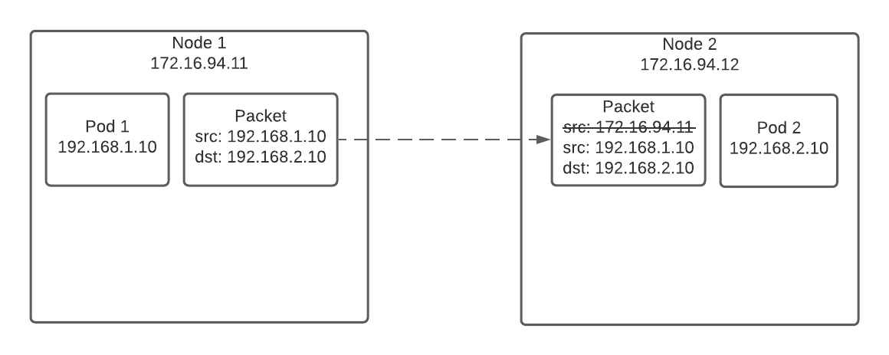
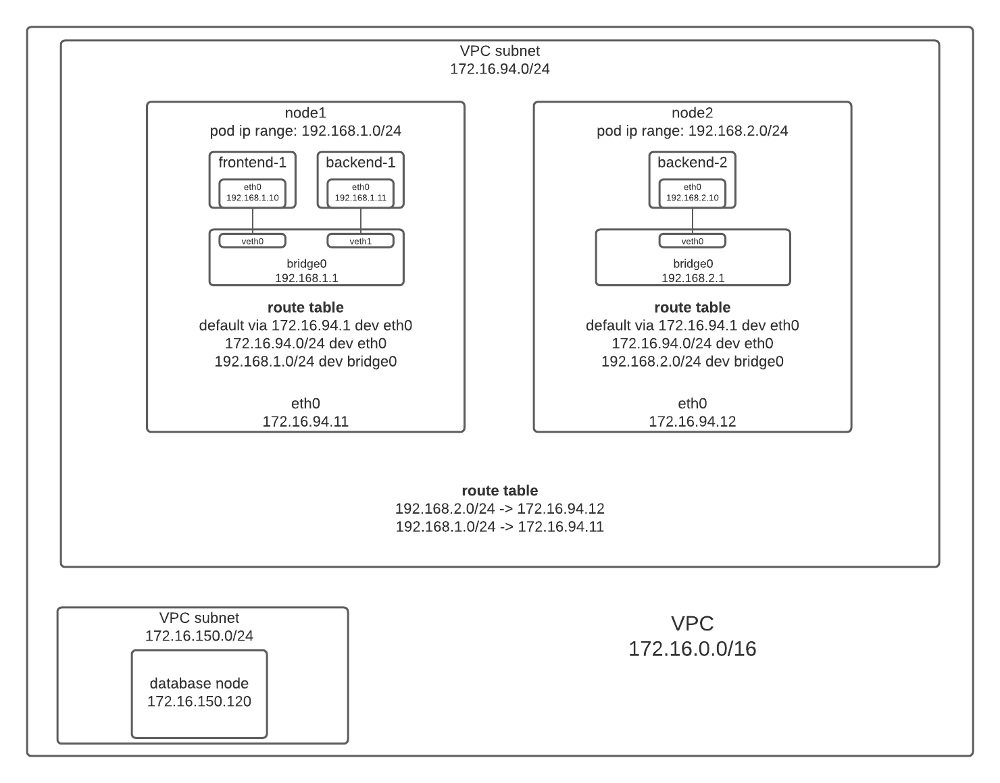
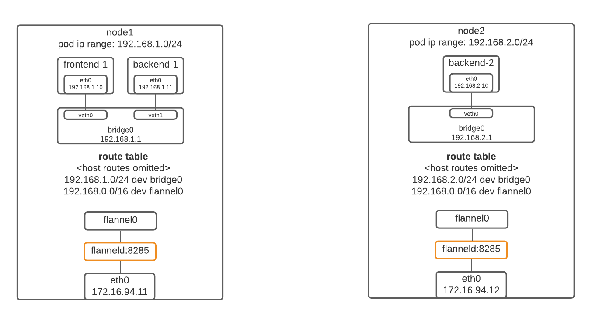
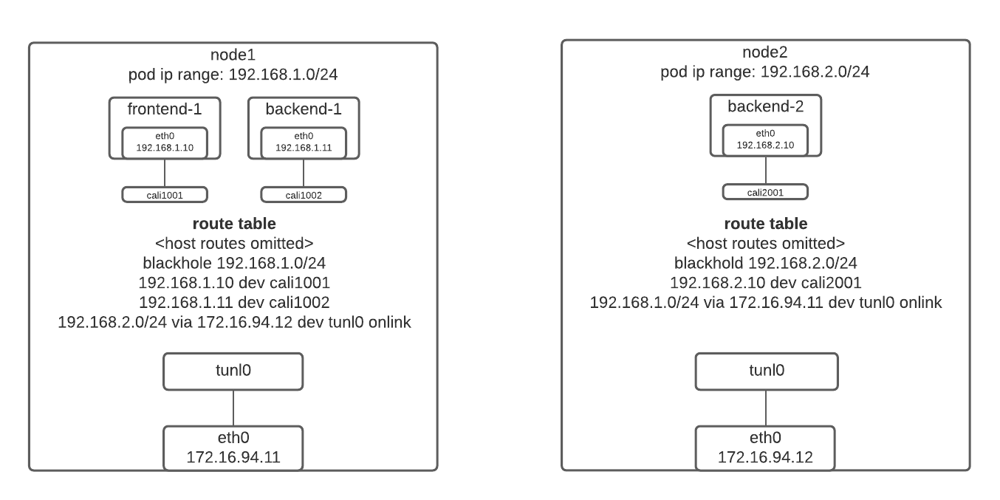

## Pods and their IP addresses

The diagram below shows how IP addresses are assigned to pods. Basically, a pod has a single IP address in Kubernetes, and this IP address is usually different from the IP address of the node that the pod is running on. For example, the pod `hello-world-1` is assigned an IP address 192.168.1.10 despite running on node 172.16.94.11.



For a Kubernetes cluster, the pods IP addresses are allocated from a different address range than the nodes addresses. In the case of our example, the nodes IP address range is 172.16.94.0/24 but the pods address range is 192.168.0.0/16. The pods address range could be divided into subnets by nodes. For example, pods allocated on the control plane node (`cp`) are in the range 192.168.0.0/24, and `node1` serves the range 192.168.1.0/24.

You might notice that some pods has the same IP address as the underlying nodes, like the `kube-apiserver`, `kube-etcd` pods running on `cp` and the `kube-proxy-*` pods running on all nodes. That is because they are special-purpose pods supporting the Kubernetes system and they have the [hostNetwork](https://kubernetes.io/docs/concepts/policy/pod-security-policy/#host-namespaces) option turned on to share the host network namespace instead of using their own. Generally for pods deployed by ourselves, they will not use the host network.

## Networking requirements

### Intra-pod communication

The first requirement for Kubernetes networking is that containers running in the same pod could communicate with each other using localhost address. This is simple, we just put all the containers belonging to the same pod into the same network namespace. It's implemented with a `pause` container which creates the network namespace, and other containers just attach themselves to it.



### Pods commmunication

The second, and the most important requirement for pods networking is: *Pods should communicate with each other without NAT*.

What does it mean? For example, pod 1 with IP address 192.168.1.10 sends a packet to pod 2 192.168.2.10. If we configured NAT according to [Access the Internet from a network namespace](http://localhost:4321/p/network-namespaces/#access-the-internet-from-a-network-namespace), pod 2 will see the source IP address to be 172.16.94.11. However, we want it to see 192.168.1.10. In other words, the packet should not be NATed.



In the sections below, let's discuss how the NAT-less communication is implemented. Basically, we will discuss four implementations:

- switched network
- kubenet
- flannel
- calico

## Switched network

Let's start from the simplest case: switched network, where all nodes are connected to a switch. A router, also connected to the switch, is used to provide Internet access.


The diagram above shows two worker nodes and two deployments. The deployment `frontend` has only one pods and the other deployment, `backend`, has two pods. The nodes are in IP address range 172.16.94.0/24 and the pods are in IP address range 192.168.0.0/16. The pods running on the same node are connected to a shared network bridge called `bridge0`, which is used for same-node pods communication.

### Same-node pods communication

The route table for the pods running on node1 looks like below.

```shell
192.168.1.0/24 dev eth0
default via 192.168.1.1 dev eth0
```

It's a typical route table configuration for [home network](/p/route-tables-and-iptables-for-routing#home-network-configuration). If `frontend-1` communicates with `backend-1`, the traffic is sent through `bridge0`. Otherwise the traffic is sent to the host. 

The route table for pods on node2 is similar, we just replace the local network range with `192.168.1.0/24` and replace the gateway address with `192.168.2.1`.

### Cross-nodes pods communication

If `frontend-1` communicates with `backend-2`, it goes through the outgoing rule 

```shell
192.168.2.0/24 via 172.16.94.12 dev eth0
```

which sends the traffic to `backend-2` with node2 as the gateway. The incoming rule on node2 then sends the traffic to `bridge0`

```shell
192.168.2.0/24 dev bridge0
```

In this way, the two pods communicate with each other without using NAT. Note that the rule `192.168.2.0/24 via 172.16.94.12 dev eth0` only enables communication between pods on node1 and node2. If another node, say, node3 is added, which serves pods 192.168.3.0/24 with IP address 172.16.94.13, we need another rule `192.168.3.0/24 via 172.16.94.13 dev eth0`. Generally, for a cluster with `n` nodes, each node has `n-1` outgoing rules for all of its neighbors.

NAT-less communication between pods doesn't mean we do not do NAT at all. NAT does occur when a pod access something outside of the pods network, for example, the Internet. We can configure the MASQUERADE rule like the following, which excludes pods network addresses from being NATed:

```shell
iptables -t nat -A POSTROUTING ! -d 192.168.0.0/16 -j MASQUERADE
```

## Kubenet

The switched network configuration only works fine for small clusters, small enough that all the machines can be switched together. What should we do for larger clusters? One possible optimization you might be thinking is moving all the cross-nodes pods routing rules like `192.168.2.0/24 via 172.16.94.12 dev eth0` to the router `172.16.94.1` for centralized management. In fact, this is what kubenet does. We generally only use kubenet in cloud environments, so the diagram looks different. Instead of using real switches and routers, all the machines are virtual machines running in a VPC subnet. The route table is provided by the cloud provider's networking infrastructure. 



From the diagram above, we see that the cross-nodes pods rules have been removed from each node. Instead, a centralized routing table is added to the nodes subnet to enable cross-nodes pods address routing. 

```shell
192.168.2.0/24 -> 172.16.94.12
192.168.1.0/24 -> 172.16.94.11
```

In this way, any traffic from `frontend-1` to `backend-2` goes through the default routing rule on node1, and then gets routed to node2 by the external route table. 

Similar to the switched network configuration, NAT is required to access something outside of the nodes subnet, like a database node at 172.16.150.120.

If you want to do experiment with kubenet you could create a Kubernetes cluster on Azure, which provides kubenet networking mode.

## Flannel

Kubenet works only on cloud environment and it works well only for small or medium clusters. What if we are deploying a Kubernetes cluster on-premise or the cluster is too large to use kubenet?

One possible solution is flannel. It works like the diagram below.



Here I omitted the host network routing rules since they are no longer important. `flannel0` is a TUN device created by `flanneld`. It looks like an interface for the host, just like `bridge0` and `eth0`, but has some special behaviors:

- If the route table routes a packet to `flannel0`, the packet will be handed to `flanneld`
- If `flanneld` writes a packet to `flannel0`, the host treats it like an incoming packet from `flannel0`, just like an incoming packet from other interfaces like `eth0`.

flannel packs every IP packets in an UDP datagram and sends them to the destination node. For example, if `frontend-1` sends a packet to `bakcend-2`, the steps will be:

1. the packet is routed to `flannel0` interface on node1 since it matches the rule `192.168.0.0/16 dev flannel0`.
2. `flannel0` hands the packet over to `flanneld`, which packs the packet in an UDP datagram. The destination port is set to 8285, while the source and destination IP addresses are set to the addresses of node1 and node2. flannel stores a mapping from pod network ranges to node IP addresses in etcd, so it's able to determine that 192.168.2.10 runs on 172.16.94.12 (node2) by looking up this mapping.
3. the UDP datagram is transmitted to node2. Note that this transmission does not depend on any underlying network architecture as long as node2 is reachable from node1 because the UDP datagram is addressed using the node address. They could be switched together, or they could be very far away and the traffic has to go through several routers along the way. They could even be virtual machines running on the cloud and thus the networking architecture is a blackbox to us. That is why we omit the host network routing rules in the diagram above.
4. the UDP datagram reaches node2 at port 8285. The `flanneld` process also listens on port 8285 so it gets the datagram.
5. `flanneld` unpacks the UDP datagram and the inner IP packet destining 192.168.2.10 gets revealed. `flanneld` then writes the inner packet to `flannel0`, which is then routed to `bridge0` by the rule `192.168.2.0/24 dev bridge0`. Note that it will not match the `flannel0` rule because of longest prefix matching.
6. `bridge0` send the packet to `backend2` whose address matches the destination address of the packet, 192.168.2.10.

The diagram below shows how the packet gets packed and unpacked.


You might be thinking that UDP is unreliable. Yes it's unreliable but it doesn't matter for our use case here. The job of flannel is to route IP packets. In other words, flannel works on layer 3, and reliability is not a requirement of this layer. Upper layers like TCP will implement reliable connection.

What we described above is how the `udp` backend of flannel works. Flannel also provides a `vxlan` backend, which achieves better performance by doing all the UDP packing and unpacking stuff in the kernel instead of an user-space process `flanneld`. 

In addition to `udp` and `vxlan`, flannel also has a `host-gw` backend which works like [Switched network](#switched-network) but manages the routing rules automatically. This backend has the best performance but works only in switched network.

## Calico

For all the configurations above, the pods on the same node are always connected to a bridge, and the route table configuration for pods all look the same as in [Same-node pods communication](#same-node-pods-communication).

```shell
192.168.1.0/24 dev eth0
default via 192.168.1.1 dev eth0
```

The bridge plays an important role in the network configurations. It provides two functionality:

- communication between pods running on the same node goes through the bridge
- for incoming packets destining a pod, the host routes it to the bridge and the bridge automatically dispatch the packet to the destination pod.

However, Linux bridge has some performance penalty. The only way to get rid of such performance impact is to stop using bridges. Calico provides an alternative solution to bridge.

### Alternative to bridge



Instead of connecting all the pods on the same node to a bridge, calico connects the other end of the veth link (`cali*`) to the host, and same-node communication is routed by the host route table. The pods are configured to send all traffic to the host by the following route table configuration:

```shell
default via 169.254.1.1 dev eth0 
169.254.1.1 dev eth0 scope link
```

You might be wondering, oh what is the magical 169.254.1.1? It turns out that there is no such address on the host. Instead, we set the `proxy_arp` option for the `cali*` interfaces to be 1 by setting the following kernel parameters:

```shell
net.ipv4.conf.cali1001.proxy_arp = 1
net.ipv4.conf.cali1002.proxy_arp = 1
```

With the `proxy_arp` option, the host will answer ARP requests from the pods. For example, say `frontend-1` wants to send a packet to `backend-1`. The destination IP address of the packet is `192.168.1.11` so it matches the `default` rule. As a result, `frontend-1` first asks the MAC address of 169.254.1.1 since it's the default gateway. The host will answer "Oh, I am 169.254.1.1, send the packet to me!" because it has `proxy_arp` set for the interface `cali1001`, even though it doesn't know where 169.254.1.1 is. As a result, `frontend-1` sends the packet to the host. The host then routes the packet to `backend-2` according to the routing rule `192.168.1.11 dev cali1002`. 

For incoming packets, the `cali*` rules send them to the destination pods directly, without going through any bridge. What is important is the `blackhole` rule, which drops all the packets destining a non-existing pod. Without the blackhole rule the packets will be sent back to the outside of the host because they match the `default` rule.

This is how calico replaces the bridge. The bridge's functionality is implemented by a magical IP address, the `proxy_arp` configuration and the `192.168.1.* dev cali*` routing rules in the host network. There will be `m` `cali*` interfaces and their `m` corresponding routing rules if there are `m` pods running on a node, plus a blackhole rule. By removing the bridge out, the override related to Linux bridge is eliminated so we get better performance. Calico also makes use of those `cali*` interfaces to implement network policies, like "a pod running a frontend server cannot access a pod running a database". 

### Cross-nodes pods networking

The `tunl0` interface is a tunnel device. If you send a packet to `tunl0` with the gateway address set as the IP address of the destination node, the packet will be tunneled to the destination. For example, if `frontend-1` sends a packet to `backend-2`, the packet will be routed to `tunl0` by the routing rule `192.168.2.0/24 via 172.16.94.12 dev tunl0 onlink`. `tunl0` then sends the packet to 172.16.94.12, the gateway address of the packet. On node2, the rule `192.168.2.10 dev cali2001` routes the packet to `backend-2`. Just like the switched network configuration, for a cluster with `n` nodes, each node has `n-1` outgoing rules for all of its neighbors.

The parameter `onlink` is important. Basically, when there is no `onlink`, the gateway has to be in the same network as the host, which means node1 and node2 have to be switched together. When `onlink` is set, the host will pretend that the gateway is in the same network, even though they might be several routers away. You can see a [discussion](https://lartc.vger.kernel.narkive.com/XgcjFTGM/aw-onlink-option-for-ip-route) here.

Calico differs from Flannel in how it encapsulates the packets. Instead of UDP encapsulation, Calico uses IPIP encapsulation, which means the inner IP packets from pods to pods are packed inside outer IP packets from nodes to nodes. By removing UDP, Calico achieves lower overhead and higher performance.

## Conclusion

The table summarizes the pros and cons of different networking configurations.

| Configuration | Pro |  Con   | 
| ----------- | ----------- | ------|
| switched network  | simple | only for small clusters   |
| kubenet   | simple  | only for small or medium clusters running on cloud providers  |
| flannel   | simple  | performance not good enough  |
| calico   | good performance and sophisticated network policies | not so simple |

What we should remember is that whichever configuration we choose, the goal is the same: Pods should communicate with each other without NAT.

## Recommended resources

- [Container Networking From Scratch](https://youtu.be/6v_BDHIgOY8)
- [Tutorial: Communication Is Key - Understanding Kubernetes Networking - Jeff Poole, Vivint Smart Home](https://youtu.be/InZVNuKY5GY)
- [Kubernetes: Flannel networking](https://blog.laputa.io/kubernetes-flannel-networking-6a1cb1f8ec7c)
- [Calico Routing Modes](https://youtu.be/MpbIZ1SmEkU)
