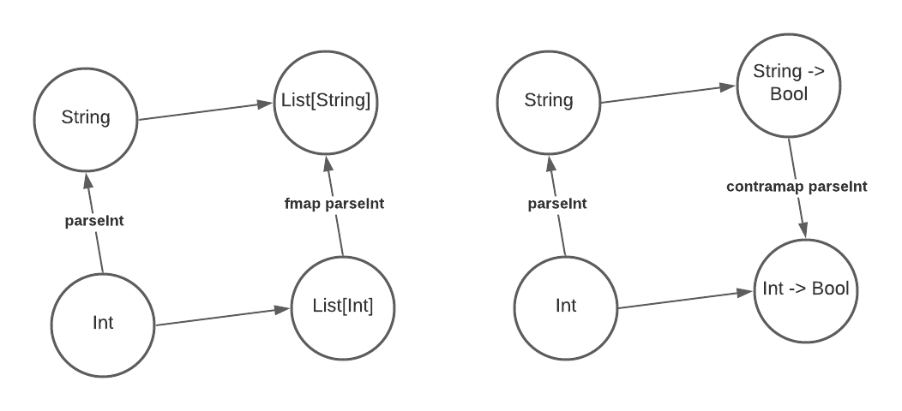

## Covariance and Contravariance, functionally

From [Covariance and Contravariance](/p/covariance-and-contravariance/) we know that generic classes can be made covariant or contravariant. In fact, the same goes for functors. Consider the following type constructor `List` in Haskell.

``` haskell
data List a = Nil | Cons a (List a)
```

It's a covariant functor because we could define a function `fmap` which takes a function from `a` to `b` and returns another function from `List a` to `List b`.

``` haskell
fmap :: (a -> b) -> (List a -> List b)
```

This is the definition of `fmap`

``` haskell
instance Functor List where
    fmap _ Nil = Nil
    fmap f (Cons x t) = Cons (f x) (fmap f t)
```

A contravariant functor is, by contrast, a type constructor `f` which we could define a `contramap` taking a function `b -> a` and returning another one `f a -> f b`.

``` haskell
contramap :: (b -> a) -> (f a -> f b)
```

An example of contravariant functors is the so called Writer type, which is essentially a function when the return type is fixed, or, `Op r` as defined below.

``` haskell
type Op r a = a -> r
```

The `contramap` is defined as

``` haskell
instance Contravariant (Op r) where
    -- (b -> a) -> Op r a -> Op r b
    -- here f is the b -> a and g is the Op r a (or a -> r)
    contramap f g = g . f
```

Notice that `f` applies before `g`. Since `f` is `b -> a` and `g` is `Op r a` (or `a -> r`) and the result type is `Op r b` (or `b -> r`), we should apply `f` first to convert `b` to `a` and then `g` which converts `a` to `r`. In other words, the `contramap` function of the writer type "inserts" the function `b -> a` before the function `a -> r`.

## Covariance and Contravariance, categorically

We know that in category theory, a functor is a mapping between categories that preserves their structures. A functor `\(F\)` between two categories is shown below.


However, in programming we generally have only one category. Below is how covariant and contravariant functors work in only one category. A covariant functor maps `a -> b` to `F a -> F b`, and a contravariant functor maps `a -> b` to `F b -> F a`.


Note that the word _functor_ is used in both category theory and functional programming. To avoid confusion I refer to functors in functional programming as _functional functors_. When a single word _functor_ is used, it means functors in category theory.

Below is how covariant and contravariant functors work from the categories perspective. Here the objects are types (like `Int` and `String`) and the morphisms are functions between types (there are a lot of morphisms between `Int` and `String`, but only `parseInt` is shown as an example). In this example, both `List`  and `Op Bool` (`a -> Bool`) are functors.



The `List` functor maps any type `a` to type `List a` and any function `f :: a -> b` to `fmap f :: List a -> List b` by applying function `f` to every element of the list. It preserves the direction of morphisms so it's covariant. In contrast, the `Op Bool` functor maps any type `a` to function type `a -> Bool` and any function `f :: a -> b` to `contramap f :: (b -> Bool) -> (a -> Bool)` by "inserting" itself before the `b -> Bool` function. It reverses the direction of morphisms so it's called contravariant.

On the other hand, below is how covariant and contravariant generics work. Here the objects are still types, but the morphisms are subtype relations. In contrast to functional functors, there are only at most one morphism between objects in this category. In this example, both `List`  and `Printer` are functors, but works on a different category than the example above.


The `List` functor maps any type `a` to type `List[a]` and any subtype relation `a < b` to `List[a] < List[b]` (here `<` means "subtype of"). It preserves the direction of morphisms so it's covariant. In contrast, the `Printer` functor maps any type `a` to `Printer[a]` and any relation `a < b` to `Printer[b] < Printer[a]`. It reverses the direction of morphisms so it's called contravariant.

In conclusion, Both functional functors and generic classes are actually functors, and the words _covariant_ and _contravariant_ in both functors and generics essentially describe the covariance/contravariance of the underlying categorical functors. However, they work on different categories. **For functors the morphisms are functions but for generics the morphisms are subtype relations**.
