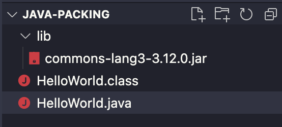
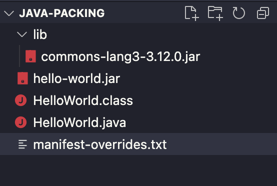

## A Java program

Compiling and running a Java program in the command line is easy. Let's start with the most basic application: Hello World. First, we create a `HelloWorld.java` file.

```java
public class HelloWorld {

    public static void main(String[] args) {
	    System.out.println("Hello");
    }
}
```

It can be compiled to a `HelloWorld.class` file with the following command:

```shell
$ javac HelloWorld.java
```

We can then run the `.class` file using the `java` command.

```shell
$ java HelloWorld
Hello World
```

Simple and easy. 

## A Java program with dependencies

What if we want to use a third-party package for our application?

We will be using the `org.apache.commons.commons-lang3` package, so [download it here](https://mvnrepository.com/artifact/org.apache.commons/commons-lang3/3.12.0) and put it into the `lib` folder of the project. The folder structure should look like the following:



Let's modify `HelloWorld.java` a little bit. 

```java
import org.apache.commons.lang3.StringUtils;

class HelloWorld {
    public static void main(String[] args) {
        System.out.println(StringUtils.capitalize("hello world"));
    }
}
```

This time, we need to use the `-classpath` argument when compiling our program. 

```shell
$ javac -classpath lib/commons-lang3-3.12.0.jar HelloWorld.java
```

The `-classpath` argument adds `commons-lang3-3.12.0.jar` to the classpath so that when we use the `import org.apache.commons.lang3.StringUtils;` statement in `HelloWorld.java`, the Java compiler is able to find the `StringUtils.class` file, which is located under `org.apache.commons.lang3` in `commons-lang3-3.12.0.jar`.

Then, how to run `HelloWorld.class`? First, let's try `java HelloWorld`.

```shell
$ java HelloWorld  

Exception in thread "main" java.lang.NoClassDefFoundError: org/apache/commons/lang3/StringUtils
        at HelloWorld.main(HelloWorld.java:5)
```

Java is complaining that it couldn't find `StringUtils`. So let's add `commons-lang3-3.12.0.jar` to classpath.

```shell
$ java -classpath lib/commons-lang3-3.12.0.jar HelloWorld

Error: Could not find or load main class HelloWorld
Caused by: java.lang.ClassNotFoundException: HelloWorld
```

It turns out that when not specifying `-classpath`, it has a default value: the current working directory. That is why we can run `java HelloWorld` directly when there are no dependencies: Java can find the `HelloWorld.class` file in the default classpath. However, now we are overriding the classpath value, so we should manually add the current directory.

```shell
$ java -classpath lib/commons-lang3-3.12.0.jar:./ HelloWorld

Hello world
```

This time it works!

The takeaway is that both the Java compiler (`javac`) and the Java virtual machine (`java`) need a classpath, which specifies where to load the classes. Classpath is an array separated by `:`, and the elements could be either local filesystem paths or `.jar` files. Third-party packages imported into our program should be added to classpath to support compilation and execution.

## Dependency scopes

Like the `commons-lang3` package we used above, most packages should be added to both compile-time classpath (`javac` command) and runtime classpath (`java` command). However, in real life, things can get much more complicated. For example, when we build an application to be deployed to a servlet container (e.g., Tomcat), the servlet API package should be added to classpath at compile-time, but should not be added to runtime classpath since the servlet container will provide the API. Another example is the JDBC connector packages (for example, `org.postgresql:postgresql`), which are not needed during compile time but are required at runtime. What makes the situation even more complicated is testing. The third-party packages supporting unit testing (like JUnit) should not be included in classpath when we compile and run the application, but should be included when we compile and run the tests.

Such complexity leads to the concept of dependency scopes in build tools like Maven and Gradle. The table below summarizes the commonly-used dependency scopes and their effects on classpath in Maven and Gradle.

| scope name (Maven) | scope name (Gradle) | classpath                            | example         |
|--------------------|---------------------|--------------------------------------|-----------------|
| compile (default)  | implementation      | compile time and runtime             | most packages   |
| provided           | compileOnly         | compile time                         | servlet APIs    |
| runtime            | runtimeOnly         | runtime                              | JDBC connectors |
| test               | testImplementation  | compile time and runtime (test only) | JUnit           |

An example of those different scopes is shown in the [spring-framework-petclinic](https://github.com/spring-petclinic/spring-framework-petclinic) project, which is built using the plain old Spring framework (i.e. no Spring Boot), and is meant to be packaged as a `war` archive and deployed to Tomcat. We see that [Tomcat packages are added to compile-time classpath only](https://github.com/spring-petclinic/spring-framework-petclinic/blob/59561e4b283f31993fb9e54a3280c94402f3ea6c/pom.xml#L105-L116) since at runtime the Tomcat container will provide them. In addition, [The MySQL driver is listed as a runtime dependency](https://github.com/spring-petclinic/spring-framework-petclinic/blob/59561e4b283f31993fb9e54a3280c94402f3ea6c/pom.xml#L519-L523). Finally, [Spring test is a test dependency since it's only required during testing](https://github.com/spring-petclinic/spring-framework-petclinic/blob/59561e4b283f31993fb9e54a3280c94402f3ea6c/pom.xml#L238-L242).

## Packaging a Java program

Let's go back to our `HelloWorld`. We can use the `jar` command to create a Jar archive out of `HelloWorld.class`.

```shell
jar -cf hello-world.jar HelloWorld.class
```

The resulting Jar file, `hello-world.jar`, contains the `HelloWorld.class` file and a _manifest_ file named `MANIFEST.MF` in the `META-INF` folder, which includes the metadata about this Jar archive. 


Note that the Jar archive doesn't have anything from the `commons-lang3` package. Therefore, we call it a _thin Jar_, which are Jars containing only our own classes and not any third-party classes.

Let's take a look at the `MANIFEST.MF` file. For our simple example, It contains only the most basic information, like the manifest version and the Java compiler information.

```ini
Manifest-Version: 1.0
Created-By: 11.0.13 (Eclipse Adoptium)
```

It does not have the `Main-Class` attribute so this `hello-world.jar` is __not executable__, which means we cannot execute it using `java -jar hello-world.jar`. However, we can execute it in the traditional way -- supplying `-classpath`.

```shell
$ java -classpath lib/commons-lang3-3.12.0.jar:hello-world.jar HelloWorld

Hello world
```

We can add the `Main-Class` attribute to `MANIFEST.MF` and make it executable. Another attribute, `Class-Path`, is also needed since we are using third-party dependencies. To do so, let's create a new file `manifest-overrides.txt`. 



We put the following to it:

```ini
Main-Class: HelloWorld
Class-Path: lib/commons-lang3-3.12.0.jar

```

**Warning**: The text file must end with a new line or carriage return. The last line will not be parsed properly if it does not end with a new line or carriage return. ([reference](https://docs.oracle.com/javase/tutorial/deployment/jar/modman.html))

Then we create a Jar archive and use the `manifest-overrides.txt` as the modification file. 

```shell
$ jar -cfm hello-world.jar manifest-overrides.txt HelloWorld.class
```

Then make sure that the `META-INF/MANIFEST.MF` file in the Jar contains `Main-Class` and `Class-Path`.

```ini
Manifest-Version: 1.0
Main-Class: HelloWorld
Class-Path: lib/commons-lang3-3.12.0.jar
Created-By: 11.0.13 (Eclipse Adoptium)
```

Now we execute our `hello-world.jar`.

```shell
$ java -jar hello-world.jar
Hello world
```

It works! Such a Jar file is called an **executable Jar** since it can be executed by the `java -jar` command directly, without specifying the main class and the classpath at the command line.

## Fat Jars

However, if we move `hello-world.jar` to another location, executing `java -jar hello-world.jar` will fail. The reason is that the `Class-Path` attribute only adds the listed Jar archives to Java classpath, it does not magically provide them. Therefore, the Java virtual machine still expects the `lib/commons-lang3-3.12.0.jar` file in our local filesystem.

This is not good when deploying an application (e.g., a website), since we have to provide all the supporting Jars for the application to run on our servers. That is why people come up with the idea of *fat Jars*: Jar archives that contain our classes and third-party classes.

We can create a fat Jar for our HelloWorld application manually. To do so, we need to:

- Extract everything from `commons-lang3-3.12.0.jar` (excluding the `META-INF` folder).
- Put the extracted files into `hello-world.jar`
- Modify the `META-INF/MANIFEST.MF` in `hello-world.jar` and remove the `Class-Path` attribute. It's not needed anymore.

Below is the resulting `hello-world.jar`. It's significantly larger than our previous one, since now it includes our `HelloWorld.class` and the `org.apache.commons.lang3` package from `commons-lang3-3.12.0.jar`.


Fat Jar archives can always be executed via `java -jar hello-world.jar` without supporting Jars. Therefore, they make it easy to deploy and distribute our applications. In practice, we build fat Jars with the help of Maven or Gradle. For example, the Spring Boot Gradle plugin provides a [bootJar](https://docs.spring.io/spring-boot/docs/current/gradle-plugin/reference/htmlsingle/#packaging-executable.jars) task which builds the whole application as a fat Jar. It works differently than the manual process I mentioned above. Still, the basic principle is similar: put all the third-party packages added to the runtime classpath (i.e. implementation scope + runtimeOnly scope) to the resulting Jar archive.

What is interesting about fat Jars is the [developmentOnly](https://docs.spring.io/spring-boot/docs/current/reference/html/using.html#using.devtools) dependency scope introduced by Spring Boot Gradle plugin. This scope is provided for the `spring-boot-devtools` package, which facilitates local development by enabling auto-restart and live reload. The developmentOnly scope is similar to the runtimeOnly scope we mentioned above. However, the package is only added to the runtime classpath but not to the resulting fat Jar. This scope is perfectly suitable for `spring-boot-devtools` since it's not needed when the application runs in production.


