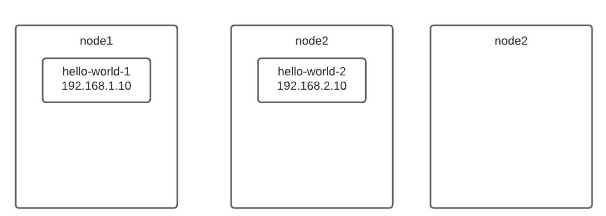
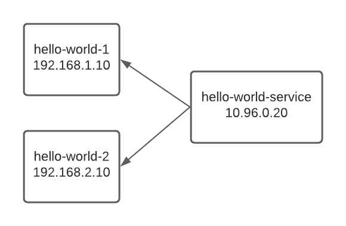

## Kubernetes services

In Kubernetes, pods come and go, which means they might be stopped, removed, or relocated when needed. For example, below is a hello-world application. When something bad happens at node 2, like power failure or insufficient disk space, pod hello-world-2 will be removed and a new pod, hello-world-3 will be created in node 3, with a different IP address than hello-world-2. In addition, we have two pods for hello-world application, it will be great if we can do load balancing automatically.



That is why we have the concept of services, which provide stable IP addresses to pods and performs load balancing. In the picture below, we have a service, hello-world-service for the two hello-world pods. Other pods communicating with hello-world just connect to the hello-world-service, and they do not need to deal with the pods directly.



To be precise, what we discussed above is a clusterIP service. We have other types of services, like nodePort, which is clusterIP + a port on every nodes. We will discuss their implementations below.

## ClusterIP implementation: Iptables

Below we will examine the iptables implementation for a service. Let's use minikube to create a kubernetes cluster first.

```shell
minikube start --nodes 3 --container-runtime containerd --kubernetes-version 1.22.4 
```

Here we started a three nodes cluster with flannel and containerd. At the time of writing, the latest stable Kubernetes version is 1.22.4 so let's use it.

Then, let's apply the following yaml to deploy a hello-world application.

```yaml
apiVersion: apps/v1
kind: Deployment
metadata:
  name: hello-world-clusterip
spec:
  replicas: 3
  selector:
    matchLabels:
      app: hello-world-clusterip
  template:
    metadata:
      labels:
        app: hello-world-clusterip
    spec:
      containers:
      - name: hello-world
        image: gcr.io/google-samples/hello-app:1.0
        ports:
        - containerPort: 8080
---
apiVersion: v1
kind: Service
metadata:
  name: hello-world-clusterip
spec:
  type: ClusterIP
  selector:
    app: hello-world-clusterip
  ports:
  - port: 80
    protocol: TCP
    targetPort: 8080
```

Then, we can see that the pods and their IP addresses using `kubectl get pods -o wide`.

```shell
NAME                                     READY   STATUS    RESTARTS   AGE   IP           NODE           NOMINATED NODE   READINESS GATES
hello-world-clusterip-6b69d8d8c5-hxn5p   1/1     Running   0          32s   10.244.1.2   minikube-m02   <none>           <none>
hello-world-clusterip-6b69d8d8c5-pjgcx   1/1     Running   0          32s   10.244.2.3   minikube-m03   <none>           <none>
hello-world-clusterip-6b69d8d8c5-tw9hs   1/1     Running   0          32s   10.244.2.2   minikube-m03   <none>           <none>
```

The hello-world-clusterip service is also created on port 80, with the IP address 10.96.139.204, which we can examine using `kubectl get services`.

```shell
NAME                    TYPE        CLUSTER-IP      EXTERNAL-IP   PORT(S)   AGE
hello-world-clusterip   ClusterIP   10.96.139.204   <none>        80/TCP    19s
```

How is a clusterIP service implemented? In fact, Kubernetes creates services by modifying the iptables rules on each node. Let's take a look at the iptables rules on the control plane node by runnng `minikube ssh` and then `sudo iptables -L -t nat`. The output is edited by the author to remove unrelated rules.

```shell
Chain PREROUTING (policy ACCEPT)
target     prot opt source               destination
KUBE-SERVICES  all  --  anywhere             anywhere             /* kubernetes service portals */

Chain INPUT (policy ACCEPT)
target     prot opt source               destination

Chain OUTPUT (policy ACCEPT)
target     prot opt source               destination
KUBE-SERVICES  all  --  anywhere             anywhere             /* kubernetes service portals */

Chain POSTROUTING (policy ACCEPT)
target     prot opt source               destination
KUBE-POSTROUTING  all  --  anywhere             anywhere             /* kubernetes postrouting rules */

Chain KUBE-MARK-MASQ (12 references)
target     prot opt source               destination
MARK       all  --  anywhere             anywhere             MARK or 0x4000

Chain KUBE-NODEPORTS (1 references)
target     prot opt source               destination

Chain KUBE-POSTROUTING (1 references)
target     prot opt source               destination
RETURN     all  --  anywhere             anywhere             mark match ! 0x4000/0x4000
MARK       all  --  anywhere             anywhere             MARK xor 0x4000
MASQUERADE  all  --  anywhere             anywhere             /* kubernetes service traffic requiring SNAT */ random-fully

Chain KUBE-SEP-72GMZXPS55D7KRDT (1 references)
target     prot opt source               destination
KUBE-MARK-MASQ  all  --  10.244.1.2           anywhere             /* default/hello-world-clusterip */
DNAT       tcp  --  anywhere             anywhere             /* default/hello-world-clusterip */ tcp to:10.244.1.2:8080

Chain KUBE-SEP-7PLRZWKB2AO42EYF (1 references)
target     prot opt source               destination
KUBE-MARK-MASQ  all  --  10.244.2.2           anywhere             /* default/hello-world-clusterip */
DNAT       tcp  --  anywhere             anywhere             /* default/hello-world-clusterip */ tcp to:10.244.2.2:8080

Chain KUBE-SEP-7ZMSKBR236QW33PN (1 references)
target     prot opt source               destination
KUBE-MARK-MASQ  all  --  10.244.2.3           anywhere             /* default/hello-world-clusterip */
DNAT       tcp  --  anywhere             anywhere             /* default/hello-world-clusterip */ tcp to:10.244.2.3:8080

Chain KUBE-SERVICES (2 references)
target     prot opt source               destination
KUBE-SVC-H3A26YYE44AE4GRF  tcp  --  anywhere             10.96.139.204        /* default/hello-world-clusterip cluster IP */ tcp dpt:www
KUBE-NODEPORTS  all  --  anywhere             anywhere             /* kubernetes service nodeports; NOTE: this must be the last rule in this chain */ ADDRTYPE match dst-type LOCAL

Chain KUBE-SVC-H3A26YYE44AE4GRF (1 references)
target     prot opt source               destination
KUBE-MARK-MASQ  tcp  -- !10.244.0.0/16        10.96.139.204        /* default/hello-world-clusterip cluster IP */ tcp dpt:www
KUBE-SEP-72GMZXPS55D7KRDT  all  --  anywhere             anywhere             /* default/hello-world-clusterip */ statistic mode random probability 0.33333333349
KUBE-SEP-7PLRZWKB2AO42EYF  all  --  anywhere             anywhere             /* default/hello-world-clusterip */ statistic mode random probability 0.50000000000
KUBE-SEP-7ZMSKBR236QW33PN  all  --  anywhere             anywhere             /* default/hello-world-clusterip */
```

